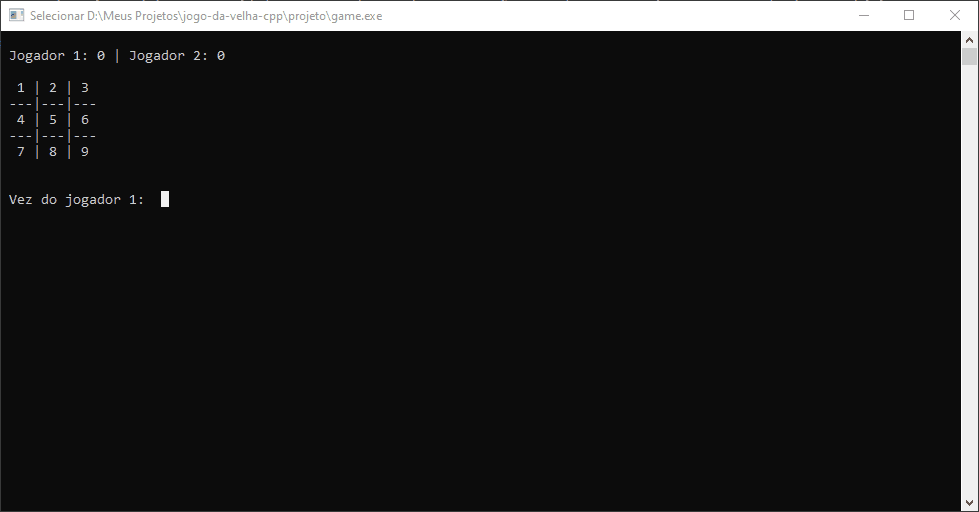

# Jogo da velha C++ (SEM ARRAY)

## Introdução

Este é um projeto que implementa o clássico jogo da velha em C++, utilizando apenas variáveis simples e estruturas de controle de fluxo, sem o uso de arrays.

O objetivo desse projeto foi desafiar a capacidade do desenvolvedor de aplicar os conceitos aprendidos em sala de aula na construção de um jogo completo e funcional. O jogo pode ser jogado através da linha de comando, com interface simples e intuitiva.

Este projeto é uma ótima oportunidade para estudantes de programação aprenderem e praticarem seus conhecimentos básicos em C++. 
